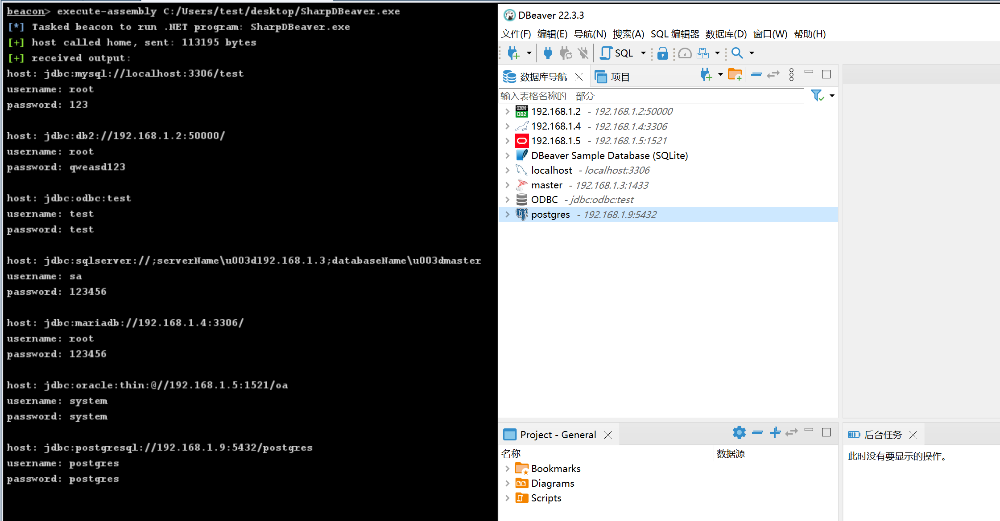

# SharpDBeaver

## 简介

DBeaver数据库密码解密工具 - 基于.NET 8重构版本，支持AOT编译

原项目地址：https://github.com/lele8/SharpDBeaver

**这是原项目的.NET 8重构版本，完全重写，支持AOT编译，遵循SOLID原则**

## 技术特性

- **.NET 8**: 使用最新的.NET 8框架，提供更好的性能和安全性
- **SOLID原则**: 代码完全按照SOLID原则重构，职责分离，易于维护
- **依赖注入**: 使用Microsoft.Extensions.DependencyInjection实现松耦合架构
- **AOT编译**: 支持Ahead-of-Time编译，生成单个可执行文件，无需运行时依赖
- **整洁代码**: 遵循DRY原则，方法简洁，代码可读性强

## 项目结构

```
SharpDBeaver/
├── Interfaces/          # 接口定义
├── Models/             # 数据模型
├── Services/           # 服务实现
└── Program.cs          # 程序入口
```

## 使用说明

### 标准编译版本
```bash
dotnet build
dotnet run
```

### AOT编译版本（推荐）

#### Windows
```bash
# 使用构建脚本
build.bat

# 或手动执行
dotnet publish -c Release
# 生成单个可执行文件：bin/Release/net8.0/win-x64/publish/SharpDBeaver.exe
```

#### Linux/macOS
```bash
# 使用构建脚本
chmod +x build.sh
./build.sh

# 或手动执行
dotnet publish -c Release
# 生成单个可执行文件：bin/Release/net8.0/linux-x64/publish/SharpDBeaver
```

### 命令行参数
```
SharpDBeaver.exe
SharpDBeaver.exe -c credentials-config.json -s data-sources.json
```



## 免责声明

本工具仅面向**合法授权**的企业安全建设行为，如您需要测试本工具的可用性，请自行搭建靶机环境。

在使用本工具时，您应确保该行为符合当地的法律法规，并且已经取得了足够的授权。**请勿对非授权目标进行攻击。**

**如您在使用本工具的过程中存在任何非法行为，您需自行承担相应后果，作者将不承担任何法律及连带责任。**

在安装并使用本工具前，请您**务必审慎阅读、充分理解各条款内容**，限制、免责条款或者其他涉及您重大权益的条款可能会以加粗、加下划线等形式提示您重点注意。 除非您已充分阅读、完全理解并接受本协议所有条款，否则，请您不要安装并使用本工具。您的使用行为或者您以其他任何明示或者默示方式表示接受本协议的，即视为您已阅读并同意本协议的约束。
